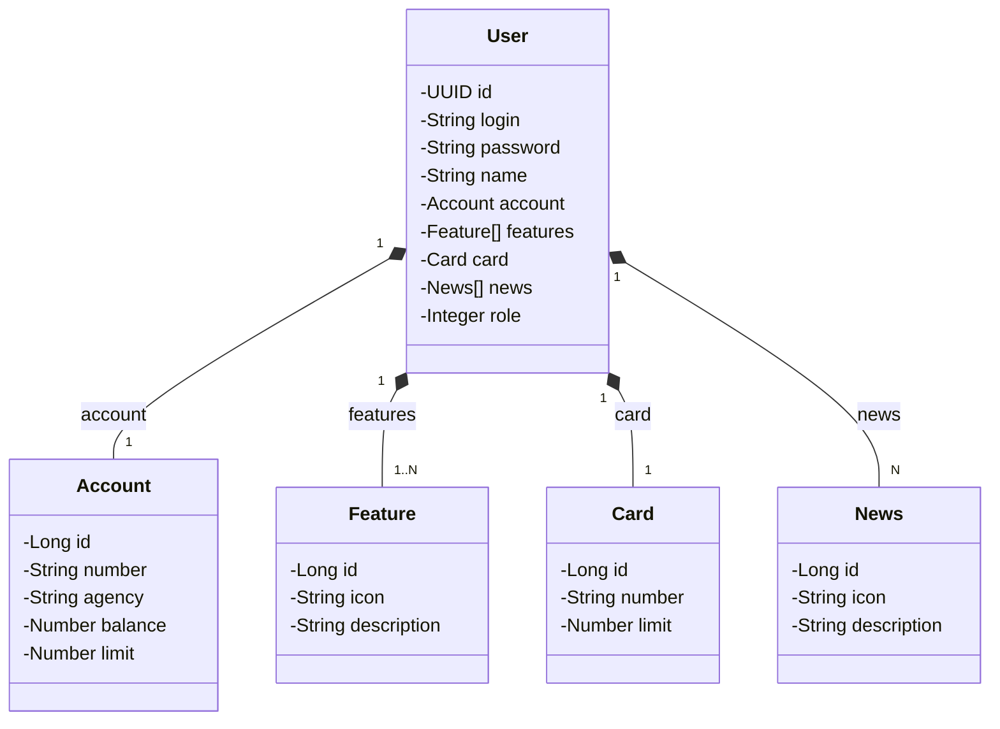
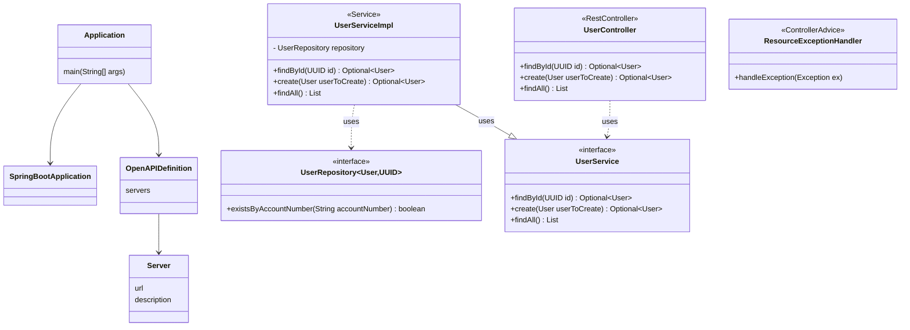
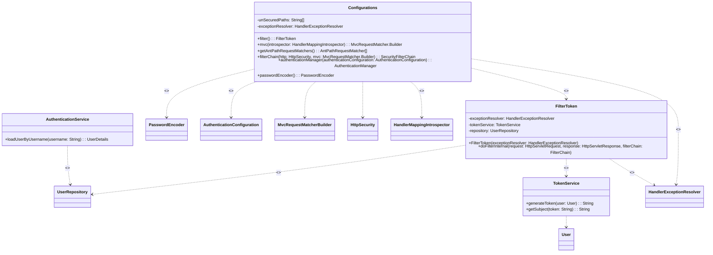
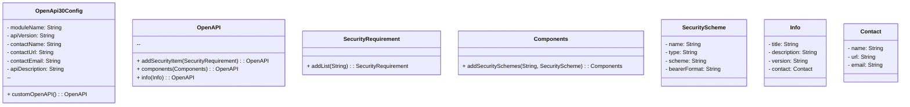
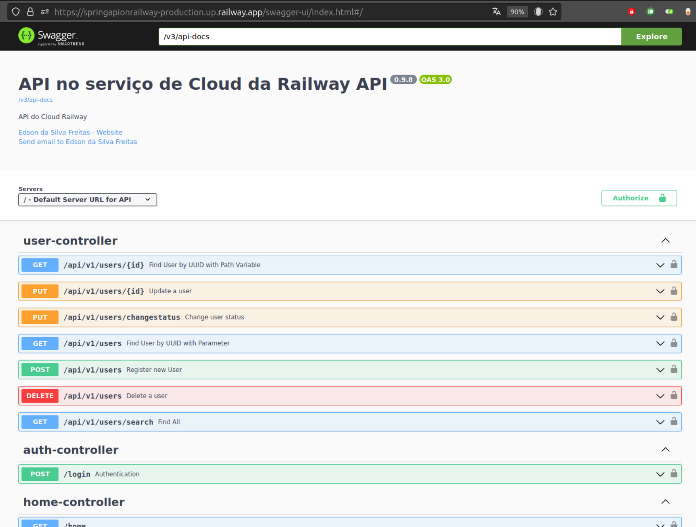

<h1 align="center">RESTFul API Spring boot no serviço de hospedagem Railway</h1>

## :memo: Resumo do projeto
Projeto de uma simples API para deploy da aplicação e do banco PostgreSQL no serviço de cloud da Railway. Para criar esse projeto como prática não precisei de cartão de crédito ou assinar qualquer plano, o serviço fornece 5 doláres para usufruirmos dos recursos como laboratório.

## :classical_building: Diagrama de Classes

## :books: Funcionalidades originais do projeto com Spring Boot versão 3
- Endpoint para inserir usuário e conta bancária e um endpoint para buscar usuário por id.

## :rocket: Funcionalidades que implementei como forma de estudo e prática de Spring Framework
- Tratamento de erros via ResourceExceptionHandler;
- Validação dos campos;
- Validação da complexidade da senha por meio de anotação personalizada;
- Endpoint para exibir todos os cadastros de usuários usando page/size/sort e limit retornando DTO;
- JWT - Autenticação e Autorização;
- HandlerExceptionResolver para capturar e personalizar as exceções do Spring Security;
- Testes unitários com Junit e Mokito;
- Controle de acesso validando se a conta do usuário está ativa, bloqueada, expirada ou se a senha está expirada;

## :wrench: Tecnologias utilizadas

* Spring Boot 3
* Spring Data JPA
* SpringDoc OpenAPI WebMVC UI
* Lombok
* Gradle 8
* Spring Boot Start Validation
* PostgreSQL
* Java 17
* Railway
* Spring Security 6
* JWT auth0 4.4
* JUnit 5
* Mokito

## :clipboard: Executando o projeto

Pré-requisitos:
- Conta no serviço online railway.app
- No railway.app adicionar o serviço de DATABASE com PostgreSQL
- No railway.app adicionar o repositório git do projeto
- Criar as variáveis de ambiente para o PostgreSQL
- Criar a variável de ambiente com nome SPRING_PROFILES_ACTIVE com valor prod
- Se tudo estar correto, o deploy será realizado automaticamente a cada commit realizado na branch main
- Após o deploy o railway irá informar a URL de acesso que pode ser personalizado

## :soon: Implementação futura

## :dart: Status do projeto

* Em andamento

## :framed_picture: Screnshoot
