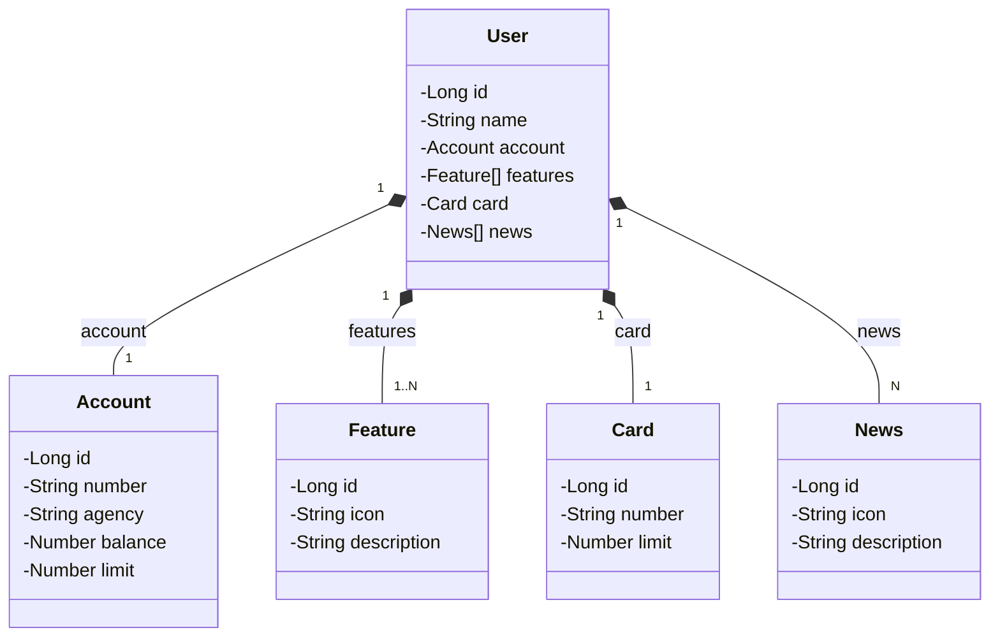
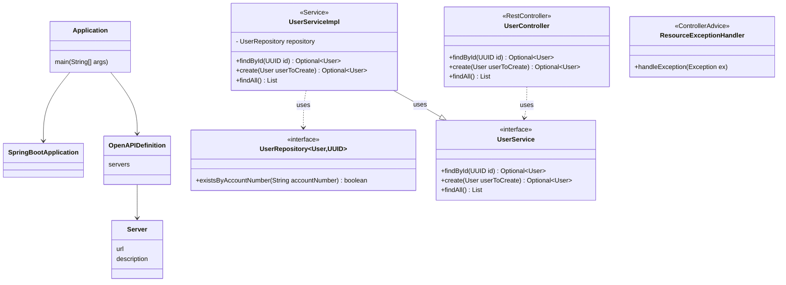

<h1 align="center">RESTFul API Spring boot no Railway</h1>

## :memo: Resumo do projeto
Projeto de uma simples API para deploy da aplicação e do banco PostgreSQL no serviço de cloud da Railway.

## :classical_building: Diagrama de Classes

## :books: Funcionalidades originais do projeto com Spring Boot versão 3
- Endpoint para inserir usuário e conta bancária e um endpoint para buscar usuário por id.

## :rocket: Funcionalidades que implementei como forma de estudo e prática de Spring Boot
- Tratamento de erros via ResourceExceptionHandler;
- Validação dos campos;
- Endpoint para exibir todos os cadastros de usuários (ainda será implementado o page, sort e limit);

## :wrench: Tecnologias utilizadas

* Spring Boot 3
* Spring Data JPA
* SpringDoc OpenAPI WebMVC UI
* Lombok
* Gradle 8
* Spring Boot Start Validation
* PostgreSQL
* Java 17
* Railway
* Spring Security 6
* JWT auth0 4.4

## :clipboard: Executando o projeto

Pré-requisitos:

## :soon: Implementação futura

## :dart: Status do projeto

* Em andamento

## :framed_picture: Screnshoot
