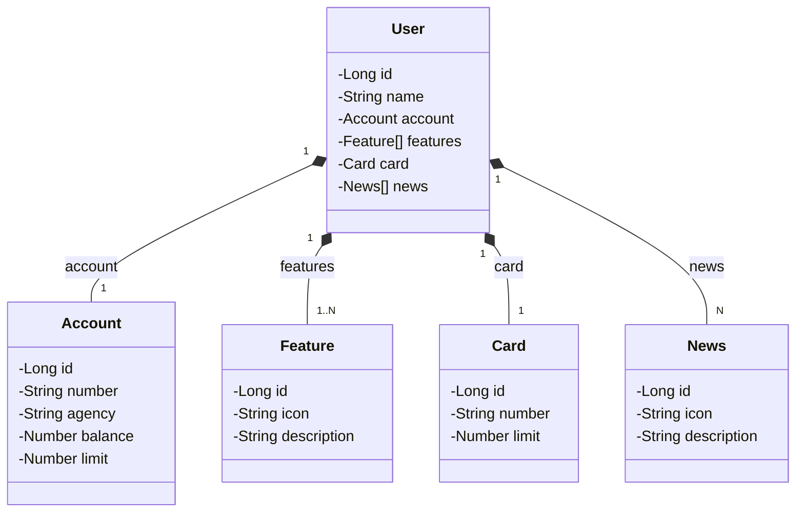

<h1 align="center">RESTFul API Spring boot no Railway</h1>

## :memo: Resumo do projeto

## Diagrama de Classes

## :books: Funcionalidades originais do projeto com Spring Boot versão 3

## :books: Funcionalidades que eu implementei como forma de estudo e prática de Spring Boot

## :wrench: Tecnologias utilizadas

* Spring Boot Web
* Spring Data JPA
* SpringDoc OpenAPI WebMVC UI
* Java 17 

## :rocket: Executando o projeto

Pré-requisitos:

## :soon: Implementação futura

## :dart: Status do projeto

* Em andamento